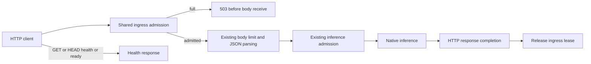

# Aggregate HTTP ingress and deployment memory

Assessment date: 2026-10-02. Baseline: `b6b6bc0bc7f308bcf5f3c3e41ca89049d0a24f6c`. Status: implemented and locally validated. Delivery stays directly on master, with Python retained by user decision.

## Evidence and official research

We inspected application middleware and both embedding routes: FastAPI parses typed JSON before the executor admits inference. The existing 16 MiB body ceiling and bounded inference queue therefore do not bound all concurrently retained HTTP representations. The base Compose configuration also lacks a memory ceiling. This is source evidence for an availability improvement; no production OOM exploit or full repository audit is claimed.

URLs were discovered through web search or GitHub MCP. [Starlette middleware guidance](https://www.starlette.io/middleware/) supports pure ASGI adapters and request-local state. Its body limiter remains responsible for individual byte limits. [Uvicorn settings](https://www.uvicorn.org/settings/) document worker processes, connection/task admission with 503 and backlog limits. [FastAPI deployment guidance](https://fastapi.tiangolo.com/deployment/concepts/) explains that workers normally hold separate model memory. [Docker resource constraints](https://docs.docker.com/engine/containers/resource_constraints) define memory and combined memory/swap ceilings and recommend measuring application requirements.

The [Compose service reference](https://docs.docker.com/reference/compose-file/services/) confirms that equal positive memory and total memory/swap limits disable container swap. This is deployment containment; the application admission counter is a separate boundary.

## Options and decision

| Option | Pros | Cons | Decision |
|---|---|---|---|
| 1. Server/proxy/container limits only | No extra application boundary; useful deployment containment | Alternative ASGI launchers can omit settings; monitoring shares server admission; parser lifetime remains indirect | Complementary |
| 2. Shared application ingress admission plus deployment limits | Rejects before receive/JSON; owns retained request lifetime; no waiting bodies; covers every ordinary HTTP route | New overload behavior; small lock cost; per-worker multiplication and native memory still require sizing | Adopt |
| 3. Separate ingress/parser service | Can isolate untrusted parser failures from loaded model workers | Extra process/protocol/auth/IPC copies and recovery rules; benefit unmeasured | Defer |

I recommend Option 2 under the current constraints. We can enforce one shared ownership rule without introducing another runtime service. Keep the existing body/image/batch limits and inference-owner controls: each protects a different lifetime.

The new boundary covers upload, parsing, queue wait, inference and downstream response sending. Releasing immediately after parsing would leave retained queue payloads unaccounted for. After an HTTP timeout, the existing inference owner still accounts for detached native work. Server/container controls cover exempt health requests.

## Implementation contract and rollout

Use an application-owned admission service and a small pure-ASGI adapter outside SlowAPI. Default `MAX_HTTP_REQUESTS=8`; count complete ordinary HTTP requests, not just embedding jobs. Acquire immediately and return sanitized JSON 503 with Retry-After when full; do not receive/drain rejected bodies or create waiters. Release in `finally` after the downstream call, including errors, disconnect, cancellation and send failures. GET/HEAD `/health` and `/ready` bypass only this application gate. Preserve 400/413/422/auth and successful response behavior for admitted requests, plus detached native-inference ownership.

`ingress.py` owns admission and immutable local statistics; `ingress_middleware.py` adapts it to ASGI. A short lock protects check/reserve/release across threads without awaiting or retaining request data. Each app owns its instance; counters are not added to the public health schema. Overload sends `Retry-After: 1` and closes HTTP/1 connections; HTTP/2 receives no connection-specific header. Admission occurs before authentication and rate checks, so saturation can return 503 before those downstream responses.

The shared Python launcher reads validated server settings: one worker, server concurrency 64 and backlog 128 by default. All image profiles use it; explicitly configure `IMAGE_EMBEDDER_WORKERS` rather than letting `WEB_CONCURRENCY` silently multiply shipped workers. Base Compose applies `IMAGE_EMBEDDER_MEMORY_LIMIT` (initial default 4 GiB) equally to memory and total memory/swap; CUDA/OpenVINO overrides inherit it. Direct ASGI users retain application admission but must configure equivalent server/container controls.

`server.py` owns startup arguments. `healthcheck.py` probes the configured listener/port without importing the model and without ambient HTTP proxies. The shipped smoke script now exercises both modules. Positive integer validation applies to ingress, workers, server concurrency and backlog, including constructor and TOML inputs; environment settings take precedence.

These defaults are an initial containment policy, not measured production model capacity. For W workers, R ingress slots and body ceiling L, raw retained HTTP body allowance is at most approximately W × R × L (128 MiB at defaults), before representation copies and other memory. JSON strings/objects, base64/image allocations, queued/detached worker inputs, native tensors, loaded models, caches and socket buffers add to that allowance. Measure peaks for pinned production models and representative batches, add headroom, then tune memory/R/worker count together. Container memory does not cap GPU VRAM. A cgroup OOM can kill the service; authentication and input ceilings still matter.

Roll out the coherent boundary/launcher/deployment change, monitor overload and measured memory, and tune before increasing workers. Rollback by reverting the coherent change or raising calibrated limits; keep previous byte/pixel and inference ownership protections.

## Verification and outcome

The complete Python 3.12 suite passed **456 tests**, including the existing detached-inference, batch-window and queue lifetime tests. Focused ingress/input/integration validation passed **123 tests**. Coverage is **93.84% lines / 87.93% branches**, above the unchanged 89.42% / 79.37% floor. One existing upstream TestClient deprecation warning remains visible. The burst test for the inference waiting budget explicitly raises ingress capacity so it continues testing its original independent boundary.

New regressions cover concurrent reservation, receive-free rejection across HTTP versions, mixed single/batch routes, independent apps, read-only probe exemptions, complete response-send ownership and release after errors, disconnect, cancellation and send failures. Real app cases preserve admitted 400/413/422 responses and avoid inference for rejected requests.

The rebuilt non-root CPU image passed its shipped offline smoke with an actual tiny CLIP projection, writable cache, authentication, configured port 8015, healthcheck module and shutdown. A separate actual Uvicorn/socket probe on port 8016 held an incomplete upload, observed receive-free 503/retry/connection-close responses, kept health/ready accessible, recovered after disconnect, preserved 401/413/422 and completed shutdown. The container's actual cgroup v1 files confirmed **4,294,967,296 memory bytes and zero additional swap**. Compose rendering confirmed the same memory/combined-swap ceilings for CPU, CUDA and OpenVINO. GPU images were not rebuilt in this iteration; their earlier native evidence is in the [backend record](backend-build-recommendation.md).

An offline controlled retention probe used distinct approximately 1 MiB JSON uploads and a held fake inference worker with a 200-request waiting budget. The comparison removed only the new middleware from the same app; all existing body/inference policy stayed identical. Python `tracemalloc` measured retained allocations after admissions settled:

| Clients | Ingress boundary | Bodies received | Queued behind worker | Rejected before receive | Retained Python allocations |
|---:|---|---:|---:|---:|---:|
| 8 | Disabled for comparison | 8 | 7 | 0 | 17.21 MiB |
| 80 | Disabled for comparison | 80 | 79 | 0 | 163.28 MiB |
| 8 | Enabled, capacity 8 | 8 | 7 | 0 | 16.39 MiB |
| 80 | Enabled, capacity 8 | 8 | 7 | 72 | 16.44 MiB |

Owners and queues returned to zero after the worker was released. This demonstrates bounded retention in that workload; it does not measure production RSS, model tensors, VRAM or throughput, or establish a production OOM vulnerability.

Strict OSV audits covered the actual CPU runtime's **56 packages** and QA environment's **67 packages** with zero known vulnerabilities, zero skips and no advisory suppression. Scoped types, style, compilation, workflow lint, copyright, coverage ratchet and whitespace checks passed. The separate [PR 51 record](pr-51-local-validation.md) describes the locally tested scanner update.

## Remaining risks and next task

The gate has no waiting queue, but slow clients can occupy its finite slots. There is no total upload/download deadline or shared cross-process ingress budget. Proxy upload timeouts, process/container sizing and server limits remain complementary. The subsequent [production-model/artifact iteration](model-artifact-contracts.md) implements pinned fixtures and versioned IR, and measures a 4.40 GiB large-model OpenVINO cold-export peak. Its override now defaults to 8 GiB/no swap; the 4 GiB measurements above remain this ingress iteration's historical evidence. The later [capacity calibration](capacity-calibration.md) measures maximum batches and both resident models on CPU/OpenVINO CPU. Next complete hash-locked dependency profiles; accelerator and simultaneous-input sizing remain workload gates. See the [recommendation stack](recommendation-stack.md).
